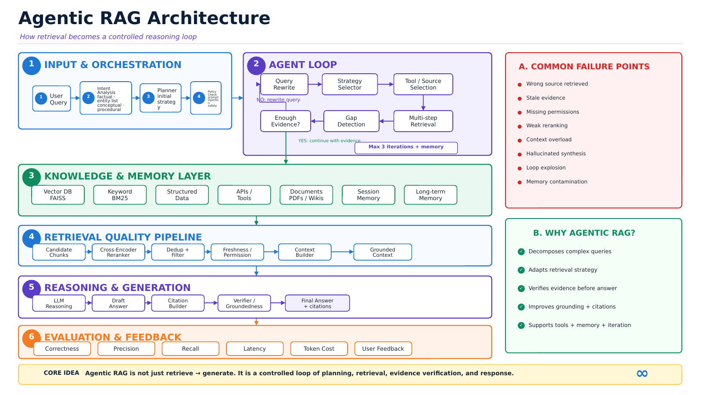

# Agentic RAG — Reference Implementation

> Retrieval becomes a **reasoning loop**: plan → retrieve → verify → respond, with hard safety rails.

This project pairs a working notebook ([`AgenticRAG.ipynb`](AgenticRAG.ipynb)) with a one-page reference architecture ([`AgenticRAG_Architecture.png`](AgenticRAG_Architecture.png)) where **every label in the diagram maps 1:1 to a real function, model, or constant in the notebook** — no marketing fluff, no hallucinated capabilities.



---

## What's inside

| File | Purpose |
| --- | --- |
| [`AgenticRAG.ipynb`](AgenticRAG.ipynb) | End-to-end notebook: agent loop, tools, retrieval-quality pipeline, verifier, RAGAS eval. Runs on Colab CPU. |
| [`AgenticRAG_Architecture_Diagram.py`](AgenticRAG_Architecture_Diagram.py) | Standalone matplotlib script that renders the reference architecture PNG. |
| [`AgenticRAG_Architecture.png`](AgenticRAG_Architecture.png) | Rendered one-page architecture diagram (200 dpi, ~800 KB). |
| [`requirements.txt`](requirements.txt) | Pinned dependency versions (same stack as the AdvancedRAG project). |

---

## The 6-tier architecture (mapped to the notebook)

| Tier | In the diagram | In the notebook |
| --- | --- | --- |
| **1 · Input & Orchestration** | User Query → Intent+Task → Planner → Policy Check | `initial_plan()` · `intent_analysis()` · `STRATEGY_FOR_INTENT` · `policy_check()` |
| **2 · Agent Loop** | Query Rewrite ↻ Retrieval Strategy ↻ Tool Selection ↻ Multi-step Retrieval ↻ Gap Detection ↻ Need More Evidence? | `agent_loop()` with `MAX_ITERS = 3` · `rewrite_query()` · `gap_check()` · `escalate_to` |
| **3 · Knowledge & Memory** | Vector DB · BM25 · SQL · APIs · Docs · Session · Long-term | FAISS + `sentence-transformers/all-MiniLM-L6-v2` · `rank_bm25` · `STRATEGIES` map · `PyMuPDFLoader` · `session_memory` |
| **4 · Retrieval Quality** | Candidate → Rerank → Dedup → Freshness/Perm → Context Builder → Grounded Context | `retrieval_quality_pipeline()` · `cross-encoder/ms-marco-MiniLM-L-6-v2` · `dedup_and_filter()` · `freshness_permission_check()` · `build_context(max_chars=4000)` |
| **5 · Reasoning & Generation** | LLM Reasoning → Draft → Citation → Verifier → Final Answer | `agentic_rag()` · Groq `llama-3.1-8b-instant` · `draft_answer()` · `build_citation_line()` · `verify_grounding()` |
| **6 · Evaluation & Feedback** | Correctness · Precision · Recall · Latency · Cost · User Feedback | RAGAS (`faithfulness`, `answer_relevancy`, `context_precision`, `context_recall`) · per-stage tracing |

---

## Failure modes → in-code guards

The eight red bullets in the diagram's right panel are each backed by real code:

| Failure mode | Guard in the notebook |
| --- | --- |
| Wrong source retrieved | Intent-aware strategy + CrossEncoder rerank |
| Stale evidence | `freshness_permission_check()` hook |
| Missing permissions | ACL hook in the same function |
| Weak reranking | `ms-marco-MiniLM-L-6-v2` CrossEncoder |
| Context overload | `build_context(max_chars = 4000)` budget |
| Hallucinated synthesis | `verify_grounding()` independent judge |
| Loop explosion | `MAX_ITERS = 3` in `agent_loop()` |
| Memory contamination | `dedup_and_filter()` + `session_memory["seen_chunk_ids"]` |

---

## Quick start

```bash
# 1. install
pip install -r requirements.txt

# 2. set your Groq key (free tier: https://console.groq.com)
export GROQ_API_KEY=gsk_...

# 3. open the notebook (Colab or local Jupyter)
jupyter lab AgenticRAG.ipynb
```

The notebook auto-downloads the demo PDF — *"Attention Is All You Need"* — and runs four benchmark questions end-to-end.

### Regenerate the architecture diagram

```bash
pip install matplotlib
python AgenticRAG_Architecture_Diagram.py
# → writes AgenticRAG_Architecture.png (200 dpi, portrait)
```

---

## Reproducibility stack (same as AdvancedRAG)

* **PDF**: [Attention Is All You Need](https://arxiv.org/pdf/1706.03762.pdf) — auto-downloaded
* **Embedding**: `sentence-transformers/all-MiniLM-L6-v2`
* **Vector store**: FAISS (in-memory)
* **Sparse index**: BM25 (`rank_bm25`)
* **Reranker**: `cross-encoder/ms-marco-MiniLM-L-6-v2`
* **LLM**: Groq `llama-3.1-8b-instant`
* **Evaluator**: RAGAS ≥ 0.2.10, < 0.3

---

## Core idea

> Agentic RAG is not just retrieve → generate. It is a **controlled loop** of planning, retrieval, verification, and response — the LLM chooses the retriever, iterates when evidence is weak, and refuses to answer beyond what the context supports.

---

## Author

**Karthikeyan Dhanakotti** ([@KarthikeyanDhanakotti](https://github.com/KarthikeyanDhanakotti))
