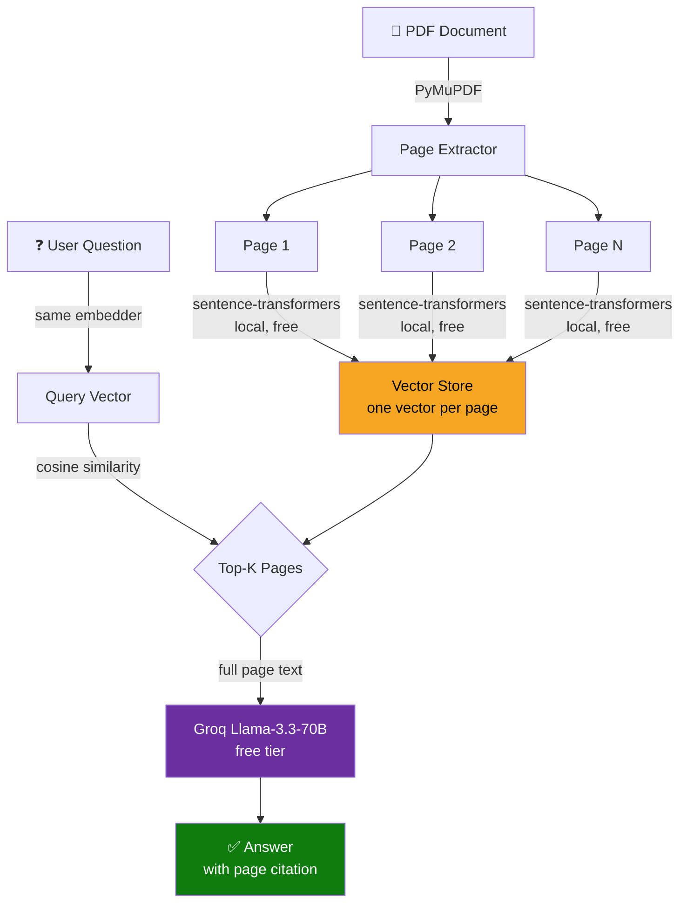

# PageIndex — Complete Guide

> **A smarter retrieval strategy for structured documents using page-level indexing, local embeddings, and free LLMs (Groq Llama).**

---

## Table of Contents

1. [What is PageIndex?](#1-what-is-pageindex)
2. [Why is it Required?](#2-why-is-it-required)
3. [When to Use PageIndex](#3-when-to-use-pageindex)
4. [Advantages](#4-advantages)
5. [RAG vs PageIndex](#5-rag-vs-pageindex)
6. [Use Cases](#6-use-cases)
7. [Architecture](#7-architecture)
8. [Flow](#8-flow)
9. [Complete Code](#9-complete-code)
10. [Output Walkthrough](#10-output-walkthrough)
11. [Conclusion](#11-conclusion)

---

## 1. What is PageIndex?

**PageIndex** is a document retrieval strategy where **each page of a document is treated as the atomic unit of indexing and retrieval** — rather than splitting the document into smaller fixed-size text chunks.

In traditional Retrieval-Augmented Generation (RAG), documents are broken into overlapping or non-overlapping chunks (typically 300–500 tokens). PageIndex instead respects the **natural page boundary** as a meaningful semantic unit.

```
Traditional RAG                    PageIndex
─────────────────────              ────────────────────
Document                           Document
  └─ Chunk 1  (500 tokens)           └─ Page 1  (full page)
  └─ Chunk 2  (500 tokens)           └─ Page 2  (full page)
  └─ Chunk 3  (500 tokens)           └─ Page 3  (full page)
  └─ Chunk 4  (500 tokens)           └─ Page N  (full page)
  └─ ...
```

Each page gets **one embedding vector**. At query time, the top-K most similar pages are retrieved and passed to the LLM as context.

---

## 2. Why is it Required?

### The Core Problem with Chunked RAG

Documents like policy manuals, legal contracts, technical specs, and financial reports are **structurally organized by page**. Each page typically covers:

- One complete policy or rule
- A table with all its rows and columns
- A numbered procedure with all steps
- A section with its heading and supporting paragraphs

When RAG chunks these documents at fixed token sizes, it **breaks the structure**:

| What Gets Broken | Example |
|---|---|
| Tables | Row 1–3 in chunk 4, Row 4–6 in chunk 5 |
| Numbered steps | Steps 1–3 in one chunk, Steps 4–5 in another |
| Section heading + content | Heading in chunk N, body in chunk N+1 |
| Related clauses | Clause and its exception split across chunks |

The LLM then receives **fragments** — it has to hallucinate the missing context or produce incomplete answers.

### PageIndex solves this by:

- Keeping all related content on a page **together**
- Returning a **complete, human-readable unit** to the LLM
- Letting the LLM see the **full structure** (tables, lists, headings)

---

## 3. When to Use PageIndex

### ✅ Use PageIndex when:

| Scenario | Reason |
|---|---|
| HR / Policy documents | Each page = one policy, fully self-contained |
| Legal contracts | Clauses and sub-clauses belong on the same page |
| Financial reports (10-K, annual) | Tables span whole pages |
| Technical manuals | Procedures are page-level units |
| Academic papers | Each section/page has a coherent argument |
| Medical guidelines | Protocols are organized page by page |
| Compliance documents | Regulations are structured by article/page |

### ❌ Avoid PageIndex when:

| Scenario | Reason |
|---|---|
| Very long pages (>2,000 tokens) | Exceeds LLM context window |
| Free-form prose / novels | No meaningful page-level structure |
| Web scraped content | Pages are arbitrary scroll lengths |
| Sub-page precision needed | Need clause-level retrieval within a large page |
| Database records | No page concept exists |

---

## 4. Advantages

### 1. Context Integrity
Tables, numbered lists, and related paragraphs on the same page are **never split**. The LLM always sees a complete, coherent unit.

### 2. No Chunk Boundary Artefacts
No more answers like *"Step 3 is... (rest of steps not retrieved)"* or *"The table shows... (only 2 of 6 rows retrieved)"*.

### 3. Natural Citation
Every retrieved unit has a clean page number — answers can cite `"See Page 3"` instead of opaque `"chunk_47"`.

### 4. Simpler Index Management
Fewer index entries than chunk-based approaches (N pages vs N×K chunks). Faster to build, easier to update.

### 5. Better Table & List Handling
LLMs understand tables when they receive the full table. Partial tables cause hallucination of missing rows/values.

### 6. Reduced Hallucination
The LLM doesn't need to mentally stitch 3–5 partial fragments. It reads one complete page — exactly as a human would.

### 7. Easier Debugging
When an answer is wrong, you know exactly which page was retrieved. With chunked RAG, you may need to inspect 5+ fragments.

---

## 5. RAG vs PageIndex

| Dimension | Chunked RAG | PageIndex |
|---|---|---|
| **Retrieval unit** | Fixed-size text chunk (300–500 tokens) | Full document page |
| **Embedding count** | Pages × chunks_per_page | One per page |
| **Table handling** | Often split across chunks | Always intact |
| **Numbered steps** | May be truncated | Always complete |
| **Hallucination risk** | Higher (fragments) | Lower (full context) |
| **Citation quality** | Chunk ID (not user-friendly) | Page number (natural) |
| **Index size** | Large (many chunks) | Small (one per page) |
| **Build time** | Slower | Faster |
| **Long page support** | ✅ Yes (chunks keep it manageable) | ⚠️ Limited by context window |
| **Sub-page precision** | ✅ Yes | ❌ No |
| **Best for** | Long free-form prose | Structured, page-organized docs |

### Visual Comparison

```
Query: "What is the parental leave entitlement?"

──────────────────────────────────────────────────────────────
Chunked RAG retrieves:
  Chunk 7:  "...maternity leave is available for eligible..."
  Chunk 8:  "...26 weeks for birth, 6 weeks for paternity..."
  Chunk 12: "...contact HR for more information on leave..."
  → LLM gets 3 fragments, table rows are missing

──────────────────────────────────────────────────────────────
PageIndex retrieves:
  Page 2: PARENTAL LEAVE POLICY
          Eligibility: 6 months continuous service
          ┌─────────────────────────┬────────────┐
          │ Maternity (birth/adopt) │ 26 weeks   │
          │ Paternity               │ 6 weeks    │
          │ Shared parental leave   │ 37 weeks   │
          └─────────────────────────┴────────────┘
          How to apply: 1. Notify manager...  4. Payroll auto-adjusted.
  → LLM gets the complete page, full table, all 4 steps
```

---

## 6. Use Cases

### 6.1 HR Policy Q&A Bot
- **Input**: Employee handbook PDF (50 pages)
- **Query**: *"How many days of sick leave do I get?"*
- **PageIndex behavior**: Retrieves the complete Leave Policy page with the full accrual table
- **Benefit**: No split tables, correct numbers returned

### 6.2 Legal Contract Analysis
- **Input**: Vendor contract (30 pages)
- **Query**: *"What are the termination clauses?"*
- **PageIndex behavior**: Returns the full Termination page (clause + sub-clauses + exceptions)
- **Benefit**: Complete legal context, no missing sub-clauses

### 6.3 Financial Report Q&A
- **Input**: Annual report / 10-K (120 pages)
- **Query**: *"What was the Q3 revenue breakdown by region?"*
- **PageIndex behavior**: Returns the full financial table page
- **Benefit**: All regional rows intact, no partial data

### 6.4 Technical Manual Assistant
- **Input**: Equipment maintenance manual (80 pages)
- **Query**: *"How do I perform a factory reset?"*
- **PageIndex behavior**: Returns the complete procedure page with all steps and warnings
- **Benefit**: No truncated steps that could cause errors

### 6.5 Compliance Document Search
- **Input**: Regulatory compliance guide (40 pages)
- **Query**: *"What are the data retention requirements?"*
- **PageIndex behavior**: Returns the full Data Retention page with all time periods and exceptions
- **Benefit**: Complete regulatory context

### 6.6 Academic Paper Q&A
- **Input**: Research paper (15 pages)
- **Query**: *"What methodology was used?"*
- **PageIndex behavior**: Returns the full Methodology section page
- **Benefit**: Complete experimental setup, no split equations or procedures

---

## 7. Architecture

```
┌─────────────────────────────────────────────────────────────────┐
│                        PageIndex System                         │
├─────────────────────────────────────────────────────────────────┤
│                                                                 │
│  ┌──────────────┐    ┌──────────────────┐    ┌──────────────┐  │
│  │   Document   │───▶│  Page Extractor  │───▶│  Page Store  │  │
│  │  (PDF/Text)  │    │  (PyMuPDF)       │    │  [P1..PN]    │  │
│  └──────────────┘    └──────────────────┘    └──────┬───────┘  │
│                                                      │          │
│                                              ┌───────▼───────┐  │
│                                              │   Embedder    │  │
│                                              │ sentence-     │  │
│                                              │ transformers  │  │
│                                              │ (local/free)  │  │
│                                              └───────┬───────┘  │
│                                                      │          │
│                                              ┌───────▼───────┐  │
│                                              │  Vector Store │  │
│                                              │  [V1..VN]     │  │
│                                              └───────────────┘  │
│                                                                 │
│  ┌──────────────┐    ┌──────────────────┐    ┌──────────────┐  │
│  │    User      │───▶│  Query Embedder  │───▶│  Cosine Sim  │  │
│  │   Question   │    │ (same model)     │    │  Top-K Pages │  │
│  └──────────────┘    └──────────────────┘    └──────┬───────┘  │
│                                                      │          │
│                                              ┌───────▼───────┐  │
│                                              │  Groq Llama   │  │
│                                              │ 3.3-70B Free  │  │
│                                              └───────┬───────┘  │
│                                                      │          │
│                                              ┌───────▼───────┐  │
│                                              │    Answer     │  │
│                                              │ (with page #) │  │
│                                              └───────────────┘  │
└─────────────────────────────────────────────────────────────────┘
```

### Component Breakdown

| Component | Tool Used | Cost |
|---|---|---|
| PDF parsing | PyMuPDF (`fitz`) | Free |
| Embeddings | `sentence-transformers` (`all-MiniLM-L6-v2`) | Free (local) |
| Vector similarity | `scikit-learn` cosine similarity | Free |
| LLM | Groq `llama-3.3-70b-versatile` | Free tier |
| **Total** | | **$0** |

---

## 8. Flow

### 8.1 Index Build Flow

```
START
  │
  ▼
Load Document (PDF or text)
  │
  ▼
Extract pages one by one
  │  page = { page_num, title, content }
  ▼
For each page:
  │  text = title + "\n\n" + content
  │  vector = sentence_transformer.encode(text)
  │  store PageNode(page_num, title, content, vector)
  ▼
PageIndex ready
  │
END (index built)
```

### 8.2 Query Flow

```
User asks a question
  │
  ▼
Embed the question
  │  query_vector = sentence_transformer.encode(question)
  ▼
Compute cosine similarity
  │  scores = cosine_similarity(query_vector, all_page_vectors)
  ▼
Retrieve Top-K pages (default K=2)
  │  ranked by similarity score
  ▼
Build context string
  │  "=== Page 2: Parental Leave (score=0.83) ===\n<full page text>"
  ▼
Send to Groq Llama
  │  system: "Answer using ONLY these pages..."
  │  user:   context + question
  ▼
Return answer with page citation
  │
END
```

### 8.3 Mermaid Diagram



---

## 9. Complete Code

### Prerequisites

```bash
pip install groq sentence-transformers scikit-learn numpy PyMuPDF
```

Get a **free** Groq API key: [https://console.groq.com/keys](https://console.groq.com/keys)

### Full Implementation

```python
"""
PageIndex vs Chunked RAG — Employee Policy Q&A
LLM   : Groq (free tier) — llama-3.3-70b-versatile
Embed : sentence-transformers (local, fully free)
"""

from __future__ import annotations

import os
import textwrap
from dataclasses import dataclass, field
from typing import List, Tuple

import numpy as np
from groq import Groq
from sentence_transformers import SentenceTransformer
from sklearn.metrics.pairwise import cosine_similarity

# ── Clients ──────────────────────────────────────────────────────────────────

groq_client = Groq(api_key=os.environ["GROQ_API_KEY"])

print("Loading embedding model (~22 MB on first run) …")
embedder = SentenceTransformer("all-MiniLM-L6-v2")
print("Embedding model ready.\n")

CHAT_MODEL = "llama-3.3-70b-versatile"

# ── Synthetic HR handbook ────────────────────────────────────────────────────

HANDBOOK_PAGES = [
    {
        "page": 1,
        "title": "Welcome & Company Overview",
        "content": "Welcome to Contoso Corp! Founded 2005. Contact hr@contoso.com.",
    },
    {
        "page": 2,
        "title": "Parental Leave Policy",
        "content": textwrap.dedent("""\
            PARENTAL LEAVE POLICY
            Eligibility: 6 months continuous service.
            Entitlements:
            | Leave Type                  | Duration     |
            |-----------------------------|--------------|
            | Maternity (birth/adoption)  | 26 weeks     |
            | Paternity                   | 6 weeks      |
            | Shared parental leave       | Up to 37 wks |
            How to apply:
            1. Notify manager 8 weeks before start.
            2. Submit form HR-PL-01 to HR portal.
            3. HR confirms within 5 business days.
            4. Payroll adjusts automatically.
            Pay: 100% first 16 weeks, 50% thereafter.
        """),
    },
    {
        "page": 3,
        "title": "Expense Reimbursement",
        "content": textwrap.dedent("""\
            EXPENSE REIMBURSEMENT POLICY
            Limits: Hotel $250/night, Meals $75/day, Economy air (<6h).
            Steps to claim:
            1. Collect receipts (photos ok for <$25).
            2. Log into portal.contoso.com/expenses.
            3. Submit within 30 days.
            4. Manager approves in 5 business days.
            5. Finance pays in next payroll cycle.
            Non-reimbursable: Fines, personal entertainment, mini-bar.
        """),
    },
]

# ── Helpers ──────────────────────────────────────────────────────────────────

def embed(texts: List[str]) -> np.ndarray:
    return embedder.encode(texts, show_progress_bar=False,
                           convert_to_numpy=True).astype(np.float32)

def llama_chat(system: str, user: str) -> str:
    response = groq_client.chat.completions.create(
        model=CHAT_MODEL,
        messages=[
            {"role": "system", "content": system},
            {"role": "user",   "content": user},
        ],
        temperature=0,
        max_tokens=1024,
    )
    return response.choices[0].message.content

# ── PageIndex ────────────────────────────────────────────────────────────────

@dataclass
class PageNode:
    page_num  : int
    title     : str
    content   : str
    embedding : np.ndarray = field(default_factory=lambda: np.array([]))

class PageIndex:
    def __init__(self):
        self.nodes: List[PageNode] = []

    def build(self, pages: List[dict]) -> None:
        texts      = [f"{p['title']}\n\n{p['content']}" for p in pages]
        embeddings = embed(texts)
        for page_dict, vec in zip(pages, embeddings):
            self.nodes.append(PageNode(**page_dict, embedding=vec))
        print(f"[PageIndex] {len(self.nodes)} pages indexed.\n")

    def retrieve(self, query: str, top_k: int = 2):
        qvec   = embed([query])
        ivecs  = np.stack([n.embedding for n in self.nodes])
        scores = cosine_similarity(qvec, ivecs)[0]
        return sorted(zip(self.nodes, scores), key=lambda x: x[1], reverse=True)[:top_k]

    def query(self, question: str, top_k: int = 2) -> str:
        hits    = self.retrieve(question, top_k)
        context = "\n\n".join(
            f"=== Page {n.page_num}: {n.title} (score={s:.3f}) ===\n{n.content}"
            for n, s in hits
        )
        print(f"Retrieved pages: {[n.page_num for n, _ in hits]}")
        return llama_chat(
            "Answer using ONLY the policy pages provided. Cite the page number.",
            f"Context:\n{context}\n\nQuestion: {question}"
        )

# ── Run ───────────────────────────────────────────────────────────────────────

if __name__ == "__main__":
    pi = PageIndex()
    pi.build(HANDBOOK_PAGES)

    questions = [
        "What is the parental leave entitlement and how do I apply?",
        "What are the hotel expense limits and claim steps?",
    ]

    for q in questions:
        print(f"\nQ: {q}")
        print(f"A: {pi.query(q)}\n")
        print("─" * 60)
```

### Using with a Real PDF

```python
import fitz  # PyMuPDF

def load_pdf_pages(pdf_path: str) -> List[dict]:
    pages, doc = [], fitz.open(pdf_path)
    for i, page in enumerate(doc, start=1):
        text = page.get_text("text").strip()
        if text:
            pages.append({
                "page"    : i,
                "title"   : text.splitlines()[0][:60],
                "content" : text,
            })
    doc.close()
    return pages

# Usage
pages = load_pdf_pages("your_document.pdf")
pi    = PageIndex()
pi.build(pages)
print(pi.query("What is the refund policy?"))
```

### Run Commands (PowerShell)

```powershell
# Step 1: Navigate to folder
cd "C:\path\to\your\project"

# Step 2: Set API key
$env:GROQ_API_KEY = "gsk_xxxxxxxxxxxxxxxxxxxx"

# Step 3: Run
.\.venv\Scripts\python.exe page_index_groq.py             # demo mode
.\.venv\Scripts\python.exe page_index_groq.py interactive  # Q&A loop
.\.venv\Scripts\python.exe page_index_groq.py document.pdf # your PDF
```

---

## 10. Output Walkthrough

```
Loading embedding model (~22 MB on first run) …
Embedding model ready.

[PageIndex] 3 pages indexed.

Q: What is the parental leave entitlement and how do I apply?

Retrieved pages: [2, 1]

A: According to Page 2 (Parental Leave Policy):

Entitlements:
| Leave Type                  | Duration     |
|-----------------------------|--------------|
| Maternity (birth/adoption)  | 26 weeks     |
| Paternity                   | 6 weeks      |
| Shared parental leave       | Up to 37 wks |

To apply:
1. Notify your manager at least 8 weeks before the start date.
2. Submit form HR-PL-01 via the HR portal.
3. HR will confirm within 5 business days.
4. Payroll will adjust automatically.

Pay: 100% for the first 16 weeks, 50% thereafter.
(See Page 2)
```

**Key observation**: The full table and all 4 steps are intact — this is what PageIndex preserves that chunked RAG cannot guarantee.

---

## 11. Conclusion

### Summary

PageIndex is not a replacement for chunked RAG — it is the **right tool for structured, page-organized documents** where page boundaries carry semantic meaning.

| If your document has... | Use... |
|---|---|
| Tables, numbered procedures, structured policies | **PageIndex** |
| Free-form long prose (novels, reports > 2K tokens/page) | **Chunked RAG** |
| Both structured and unstructured sections | **Hybrid** (PageIndex + RAG) |

### Key Takeaways

1. **PageIndex = one embedding per page** — simpler, cleaner, faster to build
2. **Local embeddings** (sentence-transformers) make it **completely free** — no paid API for embeddings
3. **Groq Llama** provides **free LLM inference** with 128K context window
4. **Tables and steps stay intact** — the biggest practical win over chunked RAG
5. **Page citations** make answers auditable and trustworthy
6. **3 lines of code** to swap from synthetic data to a real PDF via PyMuPDF

### When to Upgrade to Chunked RAG

- Document pages exceed ~2,000 tokens
- You need clause-level retrieval within a page
- Documents are pure prose with no structural elements

### Stack Used in This Project

| Layer | Technology | Cost |
|---|---|---|
| Document parsing | PyMuPDF | Free |
| Embeddings | sentence-transformers `all-MiniLM-L6-v2` | Free (local) |
| Vector search | scikit-learn cosine similarity | Free |
| LLM | Groq `llama-3.3-70b-versatile` | Free tier |
| Language | Python 3.12 | Free |

---

## References

- [Groq Console — Free API Keys](https://console.groq.com/keys)
- [sentence-transformers Documentation](https://www.sbert.net/)
- [PyMuPDF Documentation](https://pymupdf.readthedocs.io/)
- [Groq Supported Models](https://console.groq.com/docs/models)
- [scikit-learn cosine_similarity](https://scikit-learn.org/stable/modules/generated/sklearn.metrics.pairwise.cosine_similarity.html)

---


